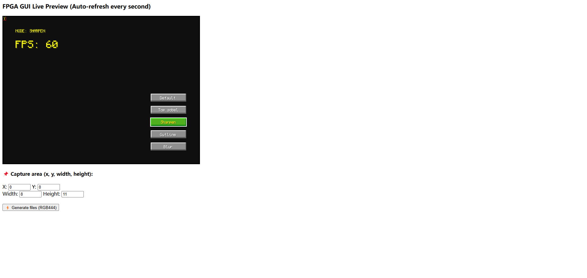
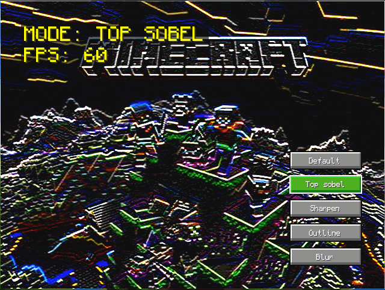

# VGA GUI Visualizer & Export Tool

This is a Python-based tool designed to help digital system developers **visualize VGA display GUIs**, especially for FPGA projects. The tool supports **hot updates**, real-time GUI feedback, and includes a pixel selection interface to **export selected areas** as **RGB444 VHDL array**.

> ⚡ Perfect for developers working on Verilog/VHDL VGA display systems who want a faster way to preview and generate GUI content.

---

## ✨ Features

- 🖥️ **VGA Display Emulation** in a Python window
- ♻️ **Hot Update**: Real-time refresh when GUI data changes
- 🔲 **Interactive Pixel Selection**: Flexible selection of a square regions to extract
- 🎨 **RGB444 Export**: Generate clean VHDL format array content

---

## 🖼️ Demo
- The simulator

  

- Some of my work (Demo of GUI of a image filter) <VGA_simulator/img/demo.gif>:

  

- Single GUI element example "letter A" <VGA_simulator/examples/FONT12/A.png>:

  
  
- VHDL example "letter A" <VGA_simulator/examples/FONT12/A.vhd>:

[View full generated VHDL ROM file](VGA_simulator/examples/FONT30/A.vhd)

---

## 🛠️ Implementation

```bash
python gen_gui.py
```

Then program gui preview code in the ```gui_code.py```
